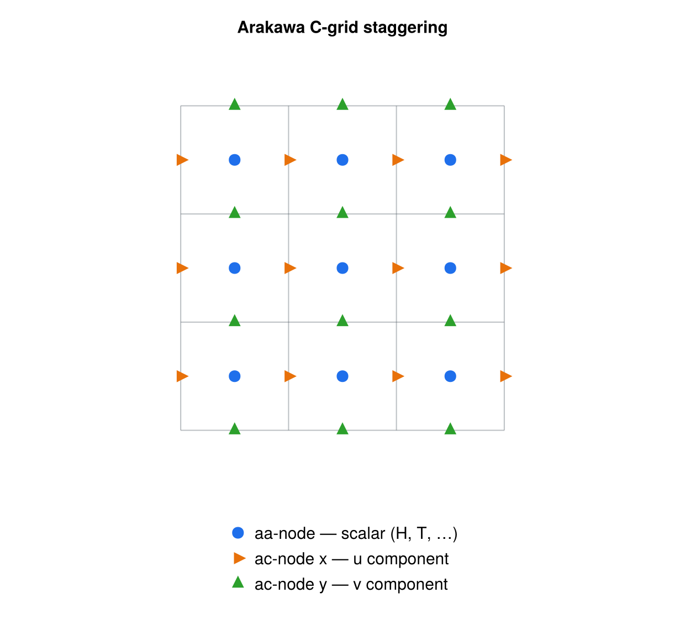

The grid-operations utilities collect the low-level array kernels used to work
with fields defined on a regular 2D (and, for derivatives, 1D) grid: moving
quantities between the nodes of an Arakawa staggered grid, taking spatial
derivatives, measuring distances to a masked feature, and refining a coarse cell
onto a finer subgrid. All routines operate on plain Fortran arrays and take the
working precision `wp` from the [precision](foundations.qmd) module (except
`subgrid`, which computes internally in double precision — see below).

## staggering

::: {.callout-warning}
## Work in progress — not yet callable

`staggering` is a stub and is **not used by any other unit**. The module declares
`private` and has no `public ::` list, so none of the routines below are
exported; additionally `calc_magnitude_from_staggered` calls
`get_neighbor_indices`, which is neither defined in the module nor imported via
`use`.

What follows documents the *intended* API. Before the module can be wired in it
needs a `public ::` list and a boundaries-aware neighbour-index routine.
:::

The `staggering` module moves fields between the nodes of an Arakawa C-grid.
Scalar (cell-centred) quantities live on the **aa-nodes**; the two components of
a vector live on the staggered **ac-nodes** at the cell edges (`acx` on the
x-edge, `acy` on the y-edge); corner values live on the **ab-nodes**. Each
procedure is a `function` of one or more `real(wp)` arrays that returns a new
`real(wp)` array of the same shape. Averaging kernels apply periodic boundary
conditions at the domain edges. Two `*_ice` variants restrict the averaging to
neighbours that satisfy an ice mask (`f_ice`, `H_ice`), falling back to the plain
four-point average when no masked neighbour is available.

{#fig-cgrid width=70%}

Procedures (all `real(wp)`):

```fortran
! Centred magnitude of a vector from its staggered (ac-node) components,
! restricted to fully ice-covered cells (f_ice == 1); `boundaries` selects the
! neighbour-indexing scheme.
function calc_magnitude_from_staggered(u, v, f_ice, boundaries) result(umag)
    real(wp), intent(IN) :: u(:,:), v(:,:)   ! acx-, acy-node components
    real(wp), intent(IN) :: f_ice(:,:)       ! ice-fraction mask
    character(len=*), intent(IN) :: boundaries
    real(wp) :: umag(:,:)                     ! aa-nodes

! Centred (aa-node) average of the staggered ac-node components.
function stagger_ac_aa(u, v) result(umag)    ! u: acx, v: acy  -> aa

! Corner/centre four-point averages between aa- and ab-nodes.
function stagger_aa_ab(u)     result(ustag)  ! aa -> ab
function stagger_ab_aa(u)     result(ustag)  ! ab -> aa
function stagger_aa_ab_ice(u, H_ice, f_ice) result(ustag)  ! aa -> ab, masked
function stagger_ab_aa_ice(u, H_ice, f_ice) result(ustag)  ! ab -> aa, masked

! Edge averages between aa/ab and the staggered ac-nodes.
function stagger_aa_acx(u) result(ustag)     ! aa  -> acx
function stagger_aa_acy(u) result(ustag)     ! aa  -> acy
function stagger_acx_aa(u) result(ustag)     ! acx -> aa
function stagger_acy_aa(u) result(ustag)     ! acy -> aa
function stagger_ab_acx(u) result(ustag)     ! ab  -> acx
function stagger_ab_acy(u) result(ustag)     ! ab  -> acy
```

Once the routines are exported, typical usage would be to interpolate
cell-centred data onto the x- and y-edges, or recover a centred vector magnitude
from staggered velocity components. (This does not compile against the module as
it currently stands — see the note above.)

```fortran
use precision,  only: wp
use staggering, only: stagger_aa_acx, stagger_aa_acy, stagger_ac_aa

real(wp) :: H(nx,ny)              ! aa-node scalar (e.g. ice thickness)
real(wp) :: ux(nx,ny), uy(nx,ny)  ! ac-node velocity components
real(wp) :: H_acx(nx,ny), H_acy(nx,ny)
real(wp) :: umag(nx,ny)

! Move the scalar field onto the staggered edges
H_acx = stagger_aa_acx(H)
H_acy = stagger_aa_acy(H)

! Recover the centred speed from the staggered velocity components
umag = stagger_ac_aa(ux, uy)
```

## derivatives

The `derivatives` module computes first spatial derivatives of a gridded field
using three-point finite-difference stencils. Interior points use a centred
stencil; boundary points use a one-sided (upstream/downstream) stencil unless
`bc == "periodic"`, in which case the centred stencil wraps around. Derivatives
are evaluated only where the logical `mask` is `.true.`; an optional `lim`
argument clamps the result to `[-lim, lim]`. Stencil weights are accumulated in
double precision internally.

Public procedures:

```fortran
public :: calc_dvdx_2D
public :: calc_dvdy_2D
public :: calc_dvdx_1D
public :: calc_dvdy_1D

! 2D field: x- and y-derivatives
subroutine calc_dvdx_2D(dvdx, v, dx, mask, bc, lim)
    real(wp), intent(OUT) :: dvdx(:,:)
    real(wp), intent(IN)  :: v(:,:)
    real(wp), intent(IN)  :: dx
    logical,  intent(IN)  :: mask(:,:)
    character(len=*), intent(IN) :: bc      ! "periodic" or otherwise
    real(wp), intent(IN), optional :: lim   ! clamp |dvdx| <= lim

subroutine calc_dvdy_2D(dvdy, v, dy, mask, bc, lim)   ! same shape, y-direction

! 1D field
subroutine calc_dvdx_1D(dvdx, v, dx, mask, bc, lim)
    real(wp), intent(OUT) :: dvdx(:)
    real(wp), intent(IN)  :: v(:)
    real(wp), intent(IN)  :: dx
    logical,  intent(IN)  :: mask(:)
    character(len=*), intent(IN) :: bc
    real(wp), intent(IN), optional :: lim

subroutine calc_dvdy_1D(dvdy, v, dy, mask, bc)   ! delegates to calc_dvdx_1D
```

Note that `calc_dvdy_1D` has no `lim` argument: in 1D it simply forwards to
`calc_dvdx_1D` (there `dvdy == dvdx`).

Example — gradient of a 2D field over its whole domain with a periodic
x-boundary and a slope limit:

```fortran
use precision,   only: wp
use derivatives, only: calc_dvdx_2D, calc_dvdy_2D

real(wp) :: z(nx,ny)            ! field to differentiate
real(wp) :: dzdx(nx,ny), dzdy(nx,ny)
logical  :: mask(nx,ny)

mask = .true.                   ! evaluate everywhere
call calc_dvdx_2D(dzdx, z, dx, mask, bc="periodic", lim=0.5_wp)
call calc_dvdy_2D(dzdy, z, dy, mask, bc="infinite")
```

## distances

The `distances` module measures, for every grid cell, the distance to the
nearest cell of a reference feature marked in an integer `mask`. It uses a
chamfer (weighted grid-propagation) distance transform with horizontal/vertical
weight `1`, diagonal weight `√2`, and a knight-move term `√5` for accuracy. The
`mask` convention is `-1` inside the feature, `0` on the feature (distance zero),
and `1` outside; the returned distance is signed accordingly (negative inside).
Distances are propagated in double precision.

Public procedure:

```fortran
public :: compute_distance_to_mask

subroutine compute_distance_to_mask(dist, mask, periodic_x, periodic_y)
    real(wp), intent(OUT) :: dist(:,:)
    integer,  intent(IN)  :: mask(:,:)     ! -1 inside, 0 at feature, 1 outside
    logical,  intent(IN), optional :: periodic_x   ! wrap i-neighbours
    logical,  intent(IN), optional :: periodic_y   ! wrap j-neighbours
```

When neither axis is periodic (the default), a single forward+backward chamfer
sweep is used. If either `periodic_x` or `periodic_y` is set, the forward and
backward sweeps are iterated (with wrapped neighbour indices) until the distance
field stops changing, so information can cross the periodic seam.

Example — signed distance to a coastline, wrapping in x:

```fortran
use precision, only: wp
use distances, only: compute_distance_to_mask

integer  :: mask(nx,ny)        ! -1 land interior, 0 coast, 1 ocean
real(wp) :: dist(nx,ny)

call compute_distance_to_mask(dist, mask, periodic_x=.true.)
! dist < 0 inland, 0 on the coast, > 0 offshore (in grid-cell units)
```

## subgrid

The `subgrid` module refines a single coarse cell of a 2D field onto an
`nxi × nxi` subgrid by bilinear interpolation. It first reconstructs the four
cell corners (ab-nodes) from the surrounding aa-node values, then fills the
subgrid array with bilinearly interpolated values between those corners. When
`nxi == 1` the routine returns the cell-centre value unchanged.

As described in the source header, the interpolation is **always performed in
double precision**: the `*_dp` procedures do the real work, and the
single-precision path consists of thin wrappers that promote their `real(sp)`
arguments, call the `*_dp` worker, and demote the result back to `real(sp)`.
Each operation is exposed through a **generic interface** so a caller built with
`wp = sp` or `wp = dp` can use the generic name and have it resolve to the
matching specific by argument kind.

Public procedures:

```fortran
public :: calc_subgrid_array            ! generic (sp/dp)
public :: calc_subgrid_array_mask       ! generic (sp/dp), with mask
public :: calc_subgrid_array_cell       ! generic (sp/dp)
public :: calc_subgrid_array_dp         ! double-precision worker
public :: calc_subgrid_array_mask_dp    ! double-precision worker (mask)
public :: calc_subgrid_array_cell_dp    ! double-precision worker

! Generic name calc_subgrid_array resolves to calc_subgrid_array_{sp,dp}:
subroutine calc_subgrid_array_dp(vint, v, nxi, i, j, im1, ip1, jm1, jp1)
    real(dp), intent(INOUT) :: vint(:,:)          ! nxi x nxi output
    real(dp), intent(IN)    :: v(:,:)             ! full aa-node field
    integer,  intent(IN)    :: nxi                ! subgrid points per side
    integer,  intent(IN)    :: i, j               ! current cell indices
    integer,  intent(IN)    :: im1, ip1, jm1, jp1 ! neighbour indices

! Masked variant: corner averages only include neighbours where mask is true.
subroutine calc_subgrid_array_mask_dp(vint, v, mask, nxi, i, j, im1, ip1, jm1, jp1)
    real(dp), intent(INOUT) :: vint(:,:)
    real(dp), intent(IN)    :: v(:,:)
    logical,  intent(IN)    :: mask(:,:)
    integer,  intent(IN)    :: nxi
    integer,  intent(IN)    :: i, j, im1, ip1, jm1, jp1

! Interpolate a cell directly from its four corner values (quadrants 1..4).
subroutine calc_subgrid_array_cell_dp(vint, v1, v2, v3, v4, nxi)
    real(dp), intent(INOUT) :: vint(:,:)
    real(dp), intent(IN)    :: v1, v2, v3, v4     ! v2--v1 / v3--v4
    integer,  intent(IN)    :: nxi
```

The `*_sp` specifics (`calc_subgrid_array_sp`, `calc_subgrid_array_mask_sp`,
`calc_subgrid_array_cell_sp`) have identical argument lists with `real(sp)`
array/scalar arguments and are reached through the generic names rather than
being called directly.

Example — refine each cell of a field onto a 5×5 subgrid using the generic
interface (resolves by the kind of `vint`/`v`):

```fortran
use precision, only: wp
use subgrid,   only: calc_subgrid_array

real(wp) :: v(nx,ny)            ! coarse aa-node field
real(wp) :: vint(nxi,nxi)       ! subgrid for one cell
integer, parameter :: nxi = 5

do j = 1, ny
do i = 1, nx
    ! (im1,ip1,jm1,jp1) computed with the caller's boundary convention
    call calc_subgrid_array(vint, v, nxi, i, j, im1, ip1, jm1, jp1)
    ! ... use vint (e.g. fractional area above a threshold) ...
end do
end do
```

## See also

- [coords](coords.qmd)
