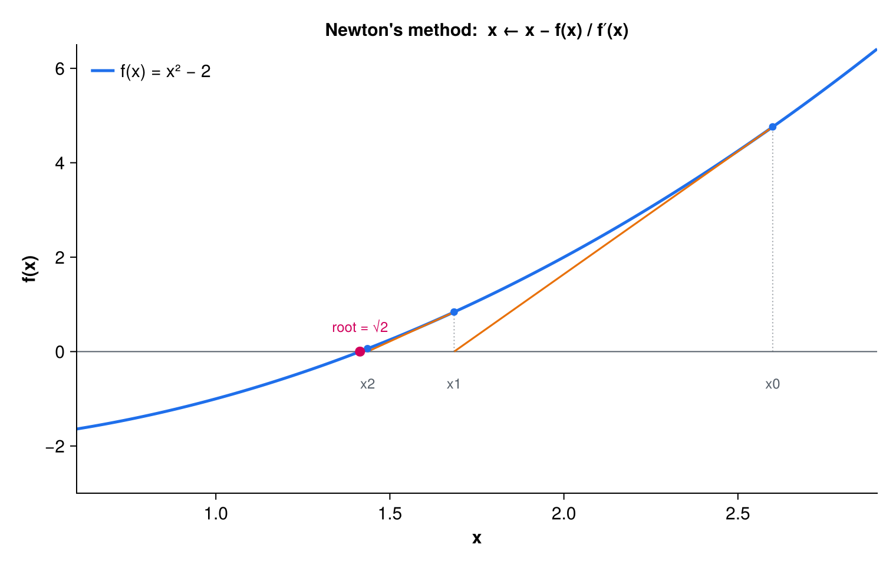

## Overview

`root_finder` locates a zero of a scalar function $f(x)$, i.e. a value `x` for
which `f(x) = 0`. Two iterative methods are provided:

- **Newton's method** (`solve_newton`) — uses the function `f` and its analytic
  derivative `fp`. From the current guess it steps along the tangent to that
  line's `x`-intercept, giving quadratic convergence near a simple root.
- **Secant method** (`solve_secant`) — a derivative-free fallback that
  approximates the slope from two successive iterates, so only `f` is needed.
  It is seeded internally from a single initial guess.

{#fig-newton width=70%}

Both routines share the same convergence controls. Iteration stops as soon as
either the residual `abs(f(x)) < tol` or the step size falls below `tol`; the
step-size test also catches flat roots (e.g. multiple roots) where the residual
stays above `tol` even though `x` has effectively stopped moving. At most
`n_max` iterations are taken. Each routine guards against its degenerate case —
a zero derivative in Newton, equal successive function values in the secant —
and exits without dividing by zero. The optional `converged` flag reports
success; on failure a warning is written and `converged` is set `.false.`.

Note: the tolerance argument was renamed `eps` → `tol` (see CHANGELOG).

## Public API

The module exports two subroutines:

```fortran
public :: solve_newton
public :: solve_secant
```

### `solve_newton`

```fortran
subroutine solve_newton(x, n_iter, x_init, tol, n_max, f, fp, debug, converged)

    real(wp), intent(OUT) :: x          ! Best guess of root
    integer,  intent(OUT) :: n_iter     ! Number of iterations taken
    real(wp), intent(IN)  :: x_init     ! Initial guess
    real(wp), intent(IN)  :: tol        ! Tolerance to convergence
    integer,  intent(IN)  :: n_max      ! Maximum iterations allowed
    real(wp), external    :: f          ! Function to find root of
    real(wp), external    :: fp         ! Derivative of the function
    logical,  intent(IN)  :: debug      ! Print iteration information?
    logical,  intent(OUT), optional :: converged  ! Did the method converge?
```

The functions `f` and `fp` are passed as external procedures, each taking a
single `real(wp)` argument and returning a `real(wp)` value. `x` returns the
best estimate of the root and `n_iter` the number of iterations used.

### `solve_secant`

```fortran
subroutine solve_secant(x, n_iter, x_init, tol, n_max, f, debug, converged)

    real(wp), intent(OUT) :: x          ! Best guess of root
    integer,  intent(OUT) :: n_iter     ! Number of iterations taken
    real(wp), intent(IN)  :: x_init     ! Initial guess
    real(wp), intent(IN)  :: tol        ! Tolerance to convergence
    integer,  intent(IN)  :: n_max      ! Maximum iterations allowed
    real(wp), external    :: f          ! Function to find root of
    logical,  intent(IN)  :: debug      ! Print iteration information?
    logical,  intent(OUT), optional :: converged  ! Did the method converge?
```

Identical to `solve_newton` but without the `fp` argument: the slope is
estimated from two iterates. The second seed point is derived internally from
`x_init`.

## Usage example

Define the objective function and its derivative as external functions, then
call `solve_newton`. This finds $\sqrt{2}$ as the positive root of
$f(x) = x^2 - 2$:

```fortran
program example_root
    use precision,   only: wp
    use root_finder, only: solve_newton

    implicit none

    real(wp) :: x
    integer  :: n_iter
    logical  :: converged

    call solve_newton(x, n_iter, x_init=1.5_wp, tol=1e-6_wp, n_max=100, &
                      f=f_sq, fp=fp_sq, debug=.false., converged=converged)

    if (converged) then
        write(*,*) "root = ", x, " after ", n_iter, " iterations"
    else
        write(*,*) "no convergence"
    end if

contains

    real(wp) function f_sq(x)
        real(wp) :: x
        f_sq = x*x - 2.0_wp
    end function f_sq

    real(wp) function fp_sq(x)
        real(wp) :: x
        fp_sq = 2.0_wp*x
    end function fp_sq

end program example_root
```

The derivative-free variant is called the same way, omitting `fp`:

```fortran
call solve_secant(x, n_iter, x_init=2.0_wp, tol=1e-6_wp, n_max=100, &
                  f=f_sq, debug=.false., converged=converged)
```

## See also

- [tsgen](tsgen.qmd)
