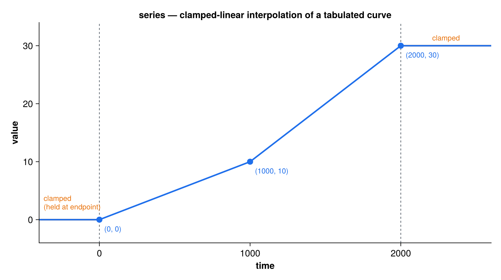

`series` is a lightweight reader for a scalar or multi-channel forcing/index
curve tabulated over time. A `series_class` holds an ordered time axis and one
or more value channels (`nc`), interpolated in time on demand. It is the
0-D/1-channel cousin of [varslice](varslice.qmd) (which handles gridded
x-y-z-time fields): reach for `series` when you just need a scalar (`nc=1`) or
multi-channel (`nc>1`, e.g. 12 monthly values) curve.

Interpolation is **clamped-linear** — endpoints are held flat outside the file's
time range — and is agnostic to the meaning of `time`: whatever axis you pass
must match the file's own axis (absolute year, year BP, elapsed time, …).

{#fig-series width=90%}

## File formats

The format is auto-detected from the filename extension (override with the `fmt`
argument):

- **ASCII** — a whitespace-delimited table `time  v1 [v2 ...]`; the channel
  count is `nc = ncols − 1`. Blank lines and lines beginning with `#` or `!` are
  skipped.
- **netCDF** — a named value variable over a time coordinate. The variable may
  be 1-D (`nc=1`) or 2-D (`nc =` the non-time dimension, either axis order). An
  optional per-time/per-channel standard deviation is read from a companion
  variable named by `sigma_name` (only if it exists in the file).

```
# co2.dat  — a scalar ASCII series (nc = 1)
#   time    co2
      0.0   280.0
   1000.0   300.0
   2000.0   340.0
```

## Public API

| Procedure | Purpose |
|---|---|
| `series_load(ser, filename, [varname], [time_name], [sigma_name], [fmt])` | Load a series from `filename`. For netCDF, `varname` selects the value variable, `time_name` the time coordinate (default `"time"`), `sigma_name` an optional standard-deviation variable. ASCII input ignores the three variable-name arguments. |
| `series_init_nml(ser, par_filename, group)` | Convenience initializer: read `filename` (and, for netCDF, `varname`/`time_name`/`sigma_name`) from a namelist group, then load. |
| `series_interp(ser, time)` | Interpolate all channels to `time`; returns a length-`nc` vector. |
| `series_interp1(ser, time)` | Scalar convenience for a single-channel series (`nc==1`); errors otherwise. |
| `series_interp_sig(ser, time)` | Interpolate the per-channel standard deviation to `time`; returns zeros if the series carries no sigma. |

The `series_class` exposes `filename`, `nt` (time points), `nc` (channels),
`time(nt)`, `var(nt,nc)`, and `sigma(nt,nc)` (unallocated when absent).

## Usage

```fortran
use series

type(series_class) :: ser
real(wp) :: co2

! ASCII: format detected from the extension; no variable names needed
call series_load(ser, "input/co2.dat")
co2 = series_interp1(ser, time=1500.0_wp)     ! clamped-linear at t = 1500
```

For a netCDF file, name the value variable (and optionally the time coordinate
and a standard-deviation companion):

```fortran
type(series_class) :: ser
real(wp) :: v(12), s(12)      ! e.g. 12 monthly channels

call series_load(ser, "input/monthly.nc", varname="pr", &
                 time_name="time", sigma_name="pr_sd")

v = series_interp(ser, time=1850.0_wp)        ! all channels
s = series_interp_sig(ser, time=1850.0_wp)    ! per-channel stddev (0 if absent)
```

Or load from a namelist group:

```fortran
call series_init_nml(ser, "params.nml", group="co2")
```

```fortran
&co2
    filename   = "input/co2.nc"
    varname    = "co2"          ! netCDF only
    time_name  = "time"         ! netCDF only
    sigma_name = "co2_sd"       ! netCDF only (read if present)
/
```

## Relationship to tsgen

[tsgen](tsgen.qmd) uses `series` directly for its `method = "series"`: it loads
the file at init and interpolates it on the absolute time axis at each update.
Use `series` on its own when you only need the tabulated curve; use `tsgen` when
you also want noise, ramps, or feedback control layered on top.

## See also

[varslice](varslice.qmd) · [tsgen](tsgen.qmd) · [ncio](ncio.qmd)
