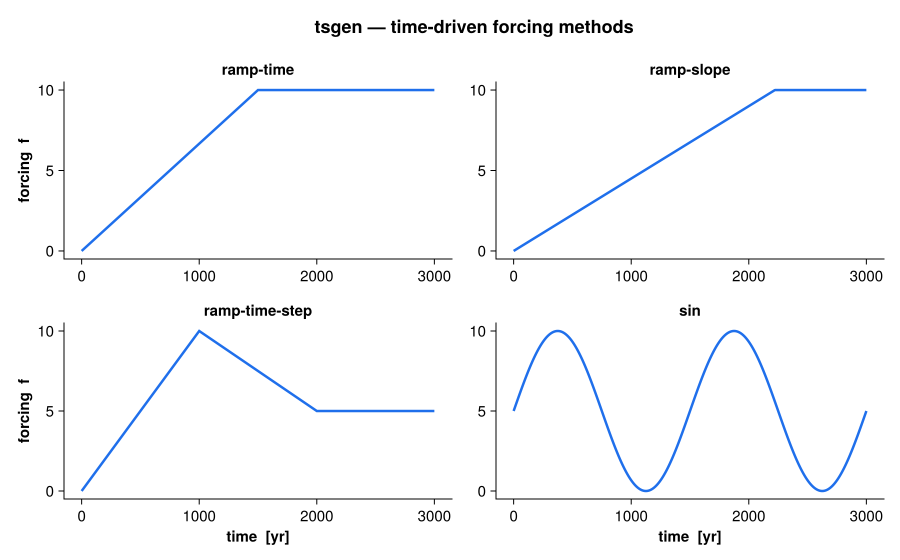

`tsgen` generates a single transient forcing value `f_now` at each model
timestep. It replaces the former (unbuilt) `hyster` module and unifies three
families of forcing under one namelist-configured interface:

- **time-driven** — an analytic function of elapsed time (`const`, `ramp-time`,
  `ramp-time-step`, `ramp-slope`, `sin`);
- **tabulated** — a curve read from file (`series`), scalar or multi-channel,
  via the [series](series.qmd) module;
- **response-driven** — stateful feedback controllers that adjust the forcing
  rate from the model's own response (`exp`, `PI42`, `H312b`, `H312PID`,
  `H321PID`, `PID1`).

{#fig-overview width=100%}

## Quick start

```fortran
use tsgen

type(tsgen_class) :: ts
real(wp) :: time, var, dvdt

! Read the &tsgen_<label> group from a namelist and set the initial value
call tsgen_init(ts, "forcing.nml", time=0.0_wp, label="climate")

do            ! model time loop
    ! var is the model response tsgen may react to (ignored by time-driven
    ! methods); dv_dt is optional (finite-differenced from var if omitted)
    call tsgen_update(ts, time, var, dv_dt=dvdt)

    ! ts%f_now is the forcing to apply this step (mean + optional noise)
    call apply_forcing(ts%f_now)

    if (ts%kill) exit          ! optional: stop once the response equilibrates
    time = time + dt
end do
```

The object carries both the mean forcing (`ts%f_mean_now`), the realized noise
sample (`ts%eps`), and the reported rate of change (`ts%df_dt`). `ts%f_now =
ts%f_mean_now + ts%eps`.

## Public API

| Procedure | Purpose |
|---|---|
| `tsgen_init(ts, filename, time, [label])` | Read the namelist group `tsgen[_label]`, classify the method, allocate state, set the initial value at simulation time `time`. |
| `tsgen_update(ts, time, var, [dv_dt])` | Advance to `time`; compute `ts%f_now` from the method, the response `var`, and (optionally) its rate `dv_dt`. |
| `tsgen_tabulate(ts, time(:), f(:), [df_dt(:)], [verbose])` | Sample the forcing over a supplied time axis (analytic and `series` methods only — feedback methods have no closed form). |
| `tsgen_write(filename, ts, time(:), f(:), [df_dt(:)])` | Write a tabulated series to netCDF (`time`, `f`, optional `df_dt`). |

`tsgen_class` holds the configuration (`ts%par`), the loaded `series` (if any),
history buffers for feedback/kill, and the runtime outputs listed above.

## Time-driven methods

All time-driven methods are closed-form functions of the elapsed time since
initialization. A leading initialization window `dt_init` holds the forcing flat
before anything happens; `df_sign` (+1/−1) sets the ramp direction, and the
value is clamped to `[f_min, f_max]`.

### `ramp-time` — linear ramp over a fixed duration

Ramps from the near bound to the far bound over `dt_ramp` years, then holds. The
rate is derived from the duration: `rate = |f_max − f_min| / dt_ramp`.

{#fig-ramp-time width=90%}

### `ramp-slope` (and `const`) — constant rate

Ramps at a fixed rate `df_dt_max` and clamps at the far bound. `const` is the
same formula (a constant-rate ramp); use `df_dt_max = 0` for a truly static
forcing.

{#fig-ramp-slope width=90%}

### `ramp-time-step` — triangle waveform

Ramps to the first extreme over `dt_ramp`, then relaxes to the convergence value
`f_conv` over `dt_conv`, and holds there.

{#fig-ramp-step width=90%}

### `sin` — periodic forcing

A sinusoid oscillating in `[f_min, f_max]` with period `dt_ramp`. The amplitude
is `½(f_max − f_min)` about the mean `½(f_max + f_min)`. Requires `df_sign = +1`
(the kill switch is disabled for periodic forcing).

{#fig-sin width=90%}

## Noise

When `sigma > 0`, a Gaussian sample `eps ~ N(0, sigma)` is drawn each step
(Box–Muller) and added on top of the mean: `f_now = f_mean + eps`. Noise is
applied to every method. For a `series` with a companion standard-deviation
variable, the per-time `sigma` from the file is used instead (falling back to
`par%sigma` where absent).

{#fig-noise width=90%}

## Response-driven (feedback) methods

Feedback methods have no analytic form — they adjust the forcing *rate* from the
model's windowed response derivative `dv_dt_ave` (averaged over `dt_ave`), then
integrate to update the mean forcing within `[f_min, f_max]`. They must be
stepped online with `tsgen_update` (passing the response `var`); `tsgen_tabulate`
rejects them.

- `exp` — exponential rate scaling: the rate collapses toward zero as the
  response derivative approaches the tolerance `tol`.
- `PI42`, `H312b`, `H312PID`, `H321PID`, `PID1` — proportional-integral(-derivative)
  controllers following the adaptive-timestep schemes of Söderlind (2002, 2003)
  and Cheng et al. (2017, GMD), with the forcing increment playing the role of
  the timestep. The controller keeps the response derivative near `tol` while
  respecting the rate cap `df_dt_max`.

The **kill switch** (`with_kill = .TRUE.`) stops the run once the response has
equilibrated (`|dv_dt_ave| < tol`) at the target bound; `ts%kill` is then set
`.TRUE.` for the caller to act on.

## Tabulated series method

`method = "series"` reads a curve from file (ASCII or netCDF, auto-detected by
extension) through the [series](series.qmd) module and interpolates it on the
file's own absolute time axis. Only `method`, `sigma`, and the `series_*` keys
are consulted. A multi-channel series (e.g. 12 monthly values) reports the
channel mean in `ts%f_now`, with per-channel values in `ts%vec%f_now(:)`.

## Namelist configuration

Parameters are read from the group `tsgen` (or `tsgen_<label>` when a `label` is
passed to `tsgen_init`). Only the keys relevant to the chosen `method` are read.

```fortran
&tsgen_climate
    method    = "ramp-time"   ! const | ramp-time | ramp-time-step | ramp-slope
                              ! | sin | series | exp | PI42 | H312b | H312PID
                              ! | H321PID | PID1
    with_kill = .FALSE.       ! stop once the response equilibrates at a bound
    sigma     = 0.0           ! stddev of the additive Gaussian noise [f]
    df_sign   = 1.0           ! ramp direction, +1 or -1 (sin requires +1)

    f_min     = 0.0           ! lower forcing bound
    f_max     = 10.0          ! upper forcing bound
    f_conv    = 5.0           ! convergence value (ramp-time-step)

    dt_init   = 0.0           ! initialization hold before forcing starts [yr]
    dt_ramp   = 1000.0        ! ramp duration; also the period for method="sin" [yr]
    dt_conv   = 1000.0        ! relaxation duration (ramp-time-step) [yr]
    dt_ave    = 200.0         ! response-averaging window (feedback/kill) [yr]

    df_dt_max = 0.01          ! max/constant forcing rate [f/yr]
    tol       = 1.0e-4        ! feedback convergence tolerance on |dv_dt_ave|
/
```

For a tabulated series, replace the ramp/feedback keys with the file location:

```fortran
&tsgen_climate
    method           = "series"
    sigma            = 0.0
    series_file      = "input/co2.nc"   ! .nc/.nc4/.cdf -> netCDF, else ASCII
    series_var       = "co2"            ! (netCDF only) value variable
    series_time_name = "time"           ! (netCDF only) time coordinate
/
```

::: {.callout-note}
The feedback-convergence tolerance was renamed `eps` → `tol` (v1.2+). The name
`eps` now denotes the realized noise sample. Existing tsgen namelists must
rename their `eps` key to `tol`.
:::

## Tabulating and writing a series

For validation or offline output, sample an analytic/`series` forcing over a
time axis and write it to netCDF:

```fortran
real(wp) :: time(2001), f(2001), dfdt(2001)
integer  :: i

do i = 1, size(time)
    time(i) = real(i-1, wp)      ! 0 .. 2000 yr
end do

call tsgen_init(ts, "forcing.nml", time=0.0_wp, label="climate")
call tsgen_tabulate(ts, time, f, df_dt=dfdt, verbose=.TRUE.)
call tsgen_write("forcing_out.nc", ts, time, f, dfdt)
```

## Reproducing the figures

The annotated figures on this page are generated by
[`docs/figures/make_figures.jl`](https://github.com/fesmc/fesm-utils/blob/main/docs/figures/make_figures.jl),
which re-implements the analytic `eval_open` formulas from `src/tsgen.f90` for
illustration. Regenerate them with:

```bash
cd docs/figures
julia --project=. make_figures.jl
```

## See also

[series](series.qmd) · [nml](nml.qmd) · [ncio](ncio.qmd) · [root_finder](root_finder.qmd)
